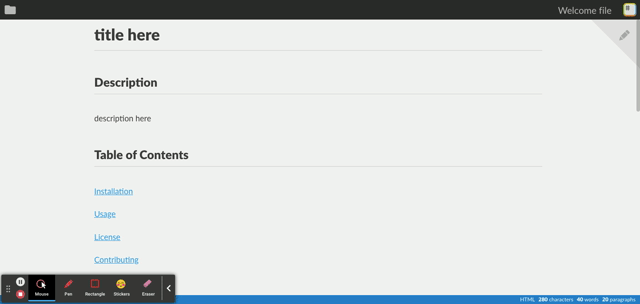

  # Professional README Generator
  
  ## Description
  
  The goal of this project was to create a professional README Generator using node.js. The user will be prompted with a series of questions regarding the README content and the file will be generated.
  
  ## Installation
  
  Instigate the application by entering the following in the command line:

```
node index.js
```
  
  
  ## Demonstration

  Command-line demo:
  
 

 End result:

 
  
  
  ## License
  
[MIT](https://github.com/abbeyschu/READMEgenerator/raw/main/assets/license.txt)
  
